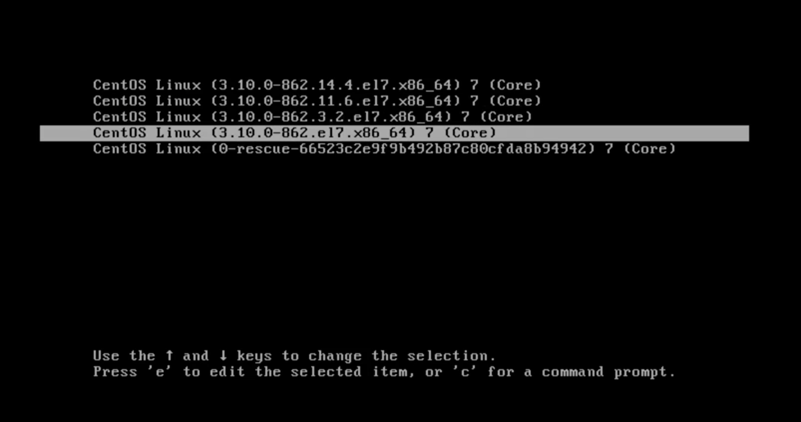

# Operation of Running Systems

### 常用指令
- top, vmstat, lsof, tcpdump, netstat, ss, htop, iotop, and iostat commands.
- iftop, nethogs, and iptraf

ss可以认为是netstat的一个升级版本。

### 如何更新Kernel版本

grub2-mkconfig 脚本用于生成 grub 的配置。
/etc/default/grub 在大多数情况下，这是唯一应该直接修改的文件。
GRUB_DEFAULT 定义启动菜单中的默认操作系统选项。可以是数字索引、菜单标题或者 "saved"。
grub2-mkconfig 脚本用于生成 grub 的配置。它综合使用 /etc/grub.d/* 和 /etc/default/grub 中的相关配置文件生成最终的 /boot/grub/grub.cfg - GRUB2 所使用的唯一配置文件。


- 下载Kernel可以使用如下命令。
```
yum update kernel -y
```
- 查看GRUB2（GRand Unified Bootloader version 2)配置。 
```
[cloud_user@d0cc44ac1f1c ~]$ ll /etc/grub2.cfg
lrwxrwxrwx. 1 root root 22 Aug  5 16:00 /etc/grub2.cfg -> ../boot/grub2/grub.cfg
```
- 查看GRUB的通用配置。

`/boot/grub2/grub.cfg` 是 GRUB2 所使用的唯一的直接的配置文件。
`/etc/default/grub`是GRUB的通用配置，`/boot/grub2/grub.cfg`可以由`grub2-mkconfig`生成，
生成时所参考的对象之一就是`/etc/default/grub`。

注意下面的例子中打印出来的`GRUB_DEFAULT`。定义启动菜单中的默认操作系统选项。可以是数字索引、菜单标题或者 "saved"。

```
[cloud_user@d0cc44ac1f1c ~]$ cat /etc/default/grub
GRUB_TIMEOUT=1
GRUB_DISTRIBUTOR="$(sed 's, release .*$,,g' /etc/system-release)"
GRUB_DEFAULT=saved
GRUB_DISABLE_SUBMENU=true
GRUB_TERMINAL="serial console"
GRUB_SERIAL_COMMAND="serial --speed=115200"
GRUB_CMDLINE_LINUX="console=ttyS0,115200 console=tty0 vconsole.font=latarcyrheb-sun16 crashkernel=auto  vconsole.keymap=us"
GRUB_DISABLE_RECOVERY="true"
```

- 查看启动菜单中的默认操作系统选项中所定义的"saved"的详细。这里需要查看另外一个文件`/boot/grub2/grubenv`。
其中包含了Kernel的详细版本。

```
[cloud_user@d0cc44ac1f1c ~]$ sudo cat /boot/grub2/grubenv
# GRUB Environment Block
saved_entry=CentOS Linux (3.10.0-1127.19.1.el7.x86_64) 7 (Core)
```
- 查看可以选择的Kernel镜像。
```
[cloud_user@d0cc44ac1f1c ~]$ sudo awk -F\' /^menuentry/{print\$2} /etc/grub2.cfg
CentOS Linux (3.10.0-1127.19.1.el7.x86_64) 7 (Core)
CentOS Linux (3.10.0-1127.18.2.el7.x86_64) 7 (Core)
CentOS Linux (3.10.0-1127.10.1.el7.x86_64) 7 (Core)
CentOS Linux (3.10.0-1127.8.2.el7.x86_64) 7 (Core)
CentOS Linux (3.10.0-1062.18.1.el7.x86_64) 7 (Core)
CentOS Linux, with Linux 0-rescue-f9afeb75a5a382dce8269887a67fbf58
```

- 使用`uname -a` 查看当前的OS的Kernel版本。
```
[cloud_user@d0cc44ac1f1c ~]$ uname -a
Linux d0cc44ac1f1c.mylabserver.com 3.10.0-1127.19.1.el7.x86_64 #1 SMP Tue Aug 25 17:23:54 UTC 2020 x86_64 x86_64 x86_64 GNU/Linux
```

- 更改启动菜单中的默认操作系统选项。
```
[cloud_user@d0cc44ac1f1c ~]$ sudo grub2-set-default 2
```

更改完成后，确认看启动菜单中的默认操作系统选项已经完成更改。
```
[cloud_user@d0cc44ac1f1c ~]$ sudo grep saved /boot/grub2/grubenv
saved_entry=2
```

- 使用`grub2-mkconfig`来生成`/boot/grub2/grub.cfg` ，这是 GRUB2 所使用的唯一的直接的配置文件。
```
[cloud_user@d0cc44ac1f1c ~]$ sudo grub2-mkconfig -o /boot/grub2/grub.cfg
Generating grub configuration file ...
Found linux image: /boot/vmlinuz-3.10.0-1127.19.1.el7.x86_64
Found initrd image: /boot/initramfs-3.10.0-1127.19.1.el7.x86_64.img
Found linux image: /boot/vmlinuz-3.10.0-1127.18.2.el7.x86_64
Found initrd image: /boot/initramfs-3.10.0-1127.18.2.el7.x86_64.img
Found linux image: /boot/vmlinuz-3.10.0-1127.10.1.el7.x86_64
Found initrd image: /boot/initramfs-3.10.0-1127.10.1.el7.x86_64.img
Found linux image: /boot/vmlinuz-3.10.0-1127.8.2.el7.x86_64
Found initrd image: /boot/initramfs-3.10.0-1127.8.2.el7.x86_64.img
Found linux image: /boot/vmlinuz-3.10.0-1062.18.1.el7.x86_64
Found initrd image: /boot/initramfs-3.10.0-1062.18.1.el7.x86_64.img
Found linux image: /boot/vmlinuz-0-rescue-f9afeb75a5a382dce8269887a67fbf58
Found initrd image: /boot/initramfs-0-rescue-f9afeb75a5a382dce8269887a67fbf58.img
done
```

注意：尽管如下所示`/boot/grub2/grub.cfg`的symlink是`/etc/grub2.cfg`，但是一定不要直接更新Symlink。
原因是，更新Symlink时，不同的Program可能会有不同的处理，如果Program处理不当可能会引起不必要的麻烦。
所以，更新时请更新其原文件。
```
[cloud_user@d0cc44ac1f1c ~]$ ll /etc/grub2.cfg
lrwxrwxrwx. 1 root root 22 Aug  5 16:00 /etc/grub2.cfg -> ../boot/grub2/grub.cfg
```

- 更新完成以后再启动。
```
[cloud_user@d0cc44ac1f1c ~]$ reboot
```

- 启动后再确认系统Kernel版本。
```
[cloud_user@d0cc44ac1f1c ~]$ uname -a
Linux d0cc44ac1f1c.mylabserver.com 3.10.0-1127.10.1.el7.x86_64 #1 SMP Wed Jun 3 14:28:03 UTC 2020 x86_64 x86_64 x86_64 GNU/Linux
```

- 如果启动不成功
  这时可以从启动菜单中选择旧的版本，回到原始设定。
  

-  一些参考资料
  - https://wiki.gentoo.org/wiki/GRUB2/zh-cn
  - https://wiki.centos.org/HowTos/Grub2
  
## 如何使用工具进行自动化

最常用的工具就是Shell，Python，Ruby这样的Script语言。比如Yum就是Python写的，sosreport也是。

## 如何制定一个具有现实意义的Plan

这一部分虽然和技术看起来无关，但是就如何制定个人或组织的长期的技术成长计划来说却是重要的。有一个SMART原则可以用于衡量您的Plan是否合适。
- Is it specific?
- Is it Measurable?
- Is it Achieveable?
- Is it Result-focused?
- Is it Time-bound?


## 如何管理已有系统的变化？
使用版本配置工具以及各种配置工具。 比如Git，Terraform，Ansible等等。这一点就可以和"Infrastructure as Code"这个概念联系起来了。

## 如何选择配置管理工具(Configuraiton Management Tool)
现在流行的配置管理工具有不少，名气比较大的有Terraform，Ansible，Chef，Puppet等等。
不同的管理工具有不同的特性和使用要求，你可以根据你所在的Team的特点来进行选择。

- Terraform: 不需安装代理，具有等幂性（不会重复操作）。 
- Ansible: 不需安装代理。内置tag属性可以实现类似于pipeline的功能。需要SSH到Server。
- Chef: 需要在Node上安装代理。多少需要对Ruby知识。
- Puppet:需要在Node上安装代理。具有等幂性。多少需要对Ruby知识。

## 如何确保硬件的完整性(Integrity)和可用性(Availability)

完整性(Integrity)主要是涉及到物理安全(Physical Security)。比如在构建data center时候需要考虑以下几点：
- 构建地点是否有灾难的可能性。（估计不会有人在核电站附近搞一个数据中心。）
- 人员进出时是怎么管理门禁的。（胸章，指纹，还是人脸识别？）
- 有没有对温度，湿度的监控？  （A**一次东京zone的当机据说就是和温度监控出了问题有关系。）
- 机柜有没有倾斜？ （不是开玩笑，这是有可能导致硬件产生问题的，事实上这样的事情曾经发生过。）

硬件可用性(Availability)主要是指Firmware的更新。母版有Firmware，NiC有Firmware，SAN有Firmware。
保护Firmware的可用也是保障硬件可用性重要的一环。

### 如何更新OS上的软件包
CentOS上有yum，Debian（比如Ubuntu）上有apt。 
注意yum是"YellowdogUpdater,Modified"的缩写。Apt是"AdvancedPackagingTool"的缩写。

Yum和Apt的用法非常相似。下面是Yum的几个例子：
```
yum install bash
yum update 
yum install http://some.path/bash.rpm
```
### 如何进行事故（Incident）管理

第一个是进行RCA。在RCA讨论中，需要着眼于分析下面几项,
- 发生了什么事情？
- 怎么发生的？
- 为什么会发生？
- 如果补救以防止再次发生？

RCA之后很重要的一点就是从长远考虑以防止相同事故再次发生。


